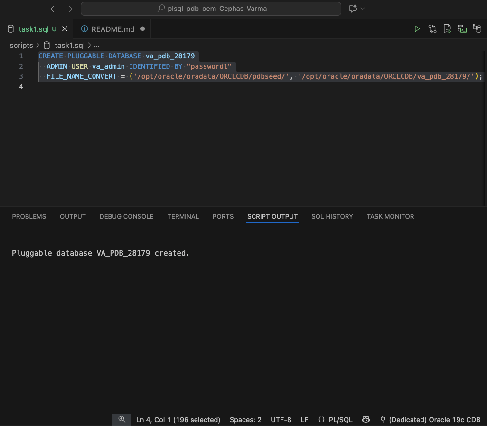
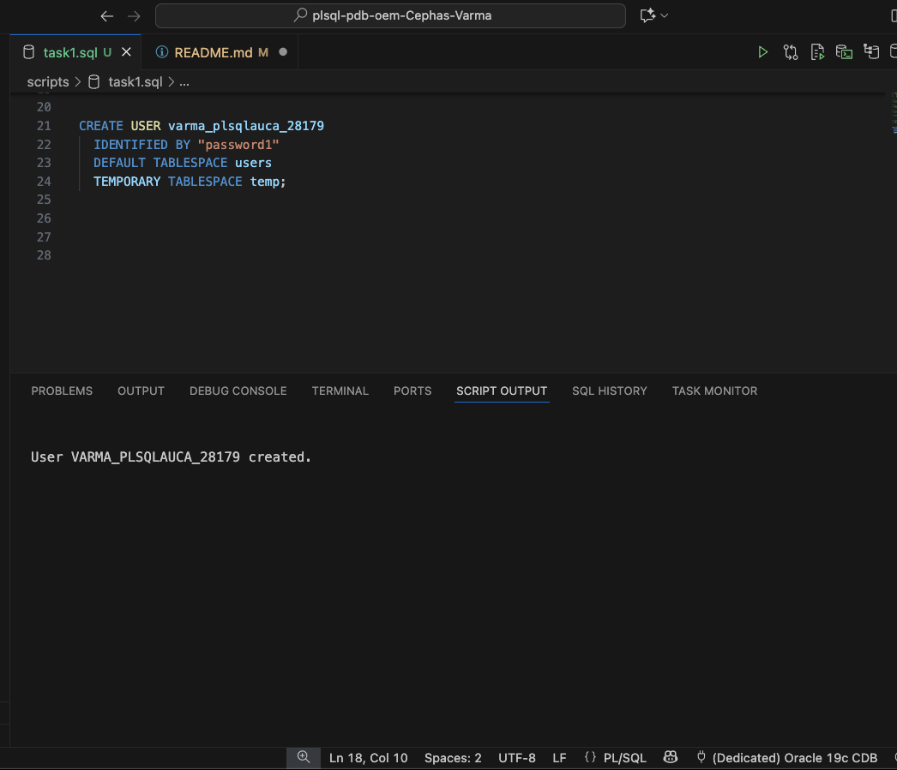
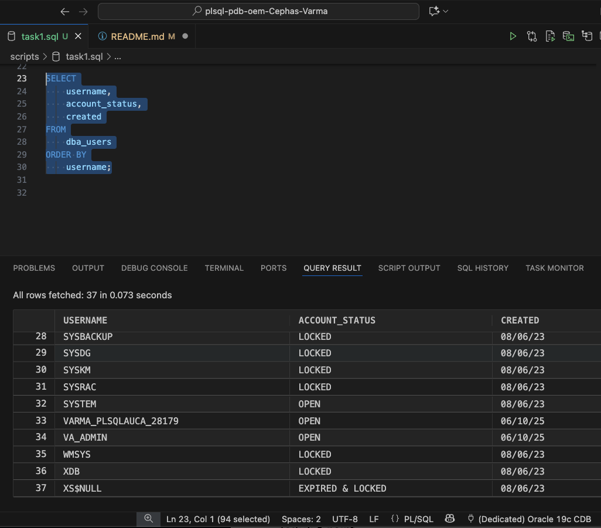
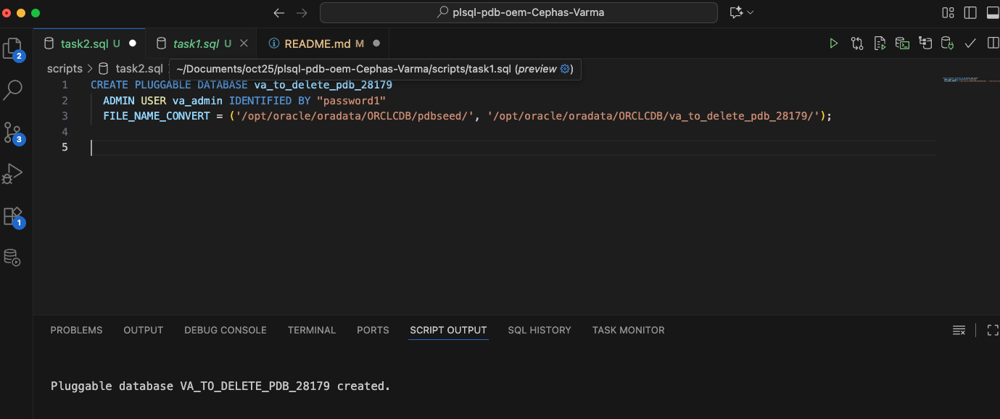
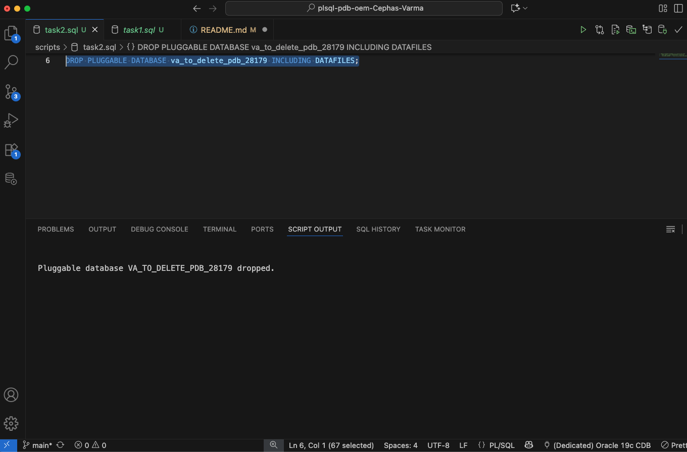
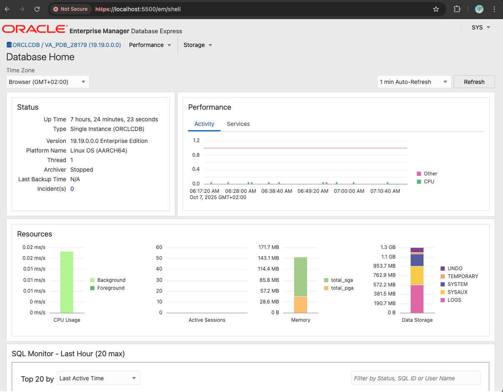
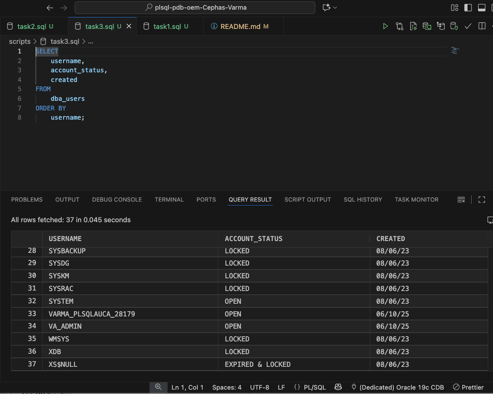

# plsql-pdb-oem-Cephas-Varma
#### Full Name: Varma Cephas V.
#### Student ID: 28179

# Overview of Tasks
## Task 1
The instruction was to establish your working environment of a pluggable database(PDB). This involves creating a new Pluggable Database (PDB) with a specific, personalized name (va_pdb_28179). Once the PDB was active,I created a dedicated user account inside it, following a strict naming convention (varma_plsqlauca_28179), and grant it the permission to persist for future class work.

## Task 2
This task was given to create and delete a pluggable database (PDB), to enhance the ability to manage the lifecycle of a PDB. I created a second, temporary PDB using the specific naming (va_to_delete_pdb_28179), immediately capturing a screenshot of the creation confirmation, and then successfully deleting it and it's associated data files.

## Task 3
The final task was to confirm the setup using the Oracle web management tool, OEM Express, Capture a final screenshot of the OEM dashboard.

# Screenshots
## PDB Creation

## Deletion

## OEM Dashboard

# Ecountered Issues and Solution
### Issue: 
Invalid GRANT Syntax (ORA-00922)

#### Problem: 
The full GRANT command was incorrectly placed inside the CREATE PLUGGABLE DATABASE statement. DCL (Grant) cannot be embedded directly within DDL (Create) this way.

#### Solution: 
Remove the embedded GRANT clause entirely. Run the user creation and privilege granting as separate, sequentially after the PDB is created.

### Issue: User Quota Zero (Cannot Create Objects)

#### Problem: 
Even with the RESOURCE role, the newly created user lacked a required quota on the default tablespace, preventing them from actually storing any data.

#### Solution: 
Explicitly grant storage space. Run an ALTER USER command to assign an appropriate quota (e.g., UNLIMITED) on the designated tablespace (USERS).

### Issue: Database Not Open (ORA-01109)

#### Problem: 
The command to change the session container (`ALTER SESSION SET CONTAINER = va_pdb_28179;`) was attempted while the target PDB was in a closed or mounted state.

#### Solution: 
Open the PDB. Use `ALTER PLUGGABLE DATABASE va_pdb_28179 OPEN READ WRITE;`; before trying to switch the session container.

